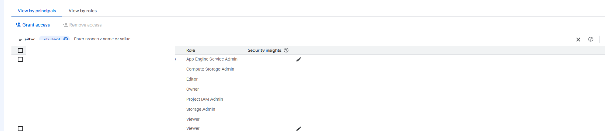
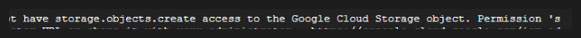
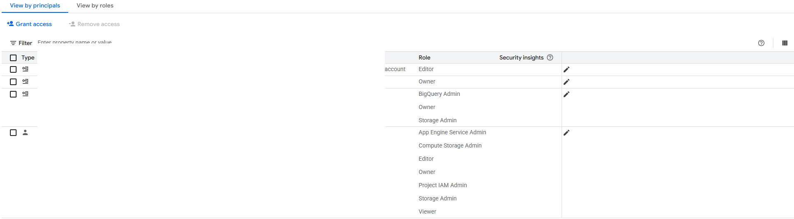
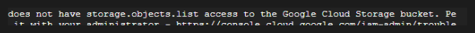
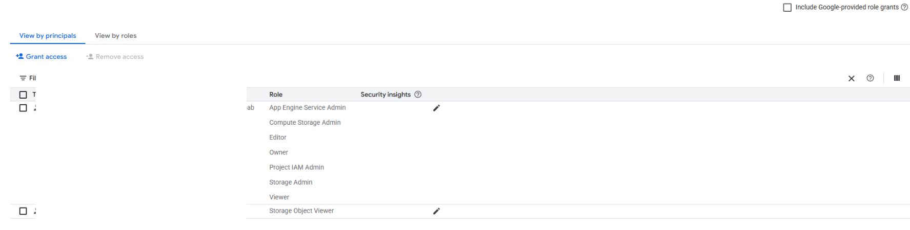
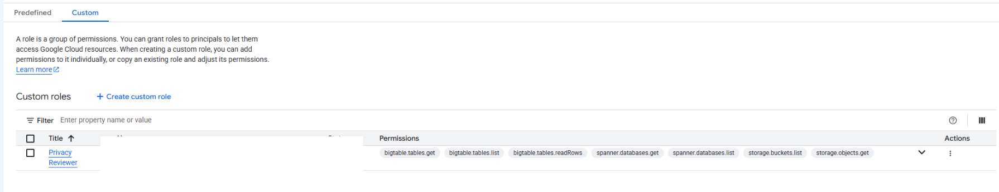
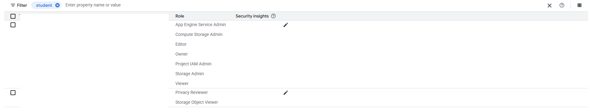

# Google Cloud IAM Access Control and Custom Roles Lab

This repository documents a Google Cloud Skills Boost lab where I worked through IAM access control using two temporary lab users, Cloud Storage, predefined roles, and custom roles.

The part I found most useful was seeing access change as the role assignments changed. I started with broad project visibility, removed that access, added back a narrower Storage Object Viewer role, and then created and maintained custom roles.

> **Training note:** This was completed in a temporary Google Cloud Skills Boost environment. It was hands-on training, not a production deployment.

## What I Practiced

- Reviewing IAM role assignments for different principals
- Testing the difference between read and write permissions
- Removing project-level access and verifying the effect
- Granting the predefined Storage Object Viewer role
- Applying least-privilege access to a specific service
- Creating a custom IAM role in the Google Cloud console
- Creating a second custom role through `gcloud` and YAML
- Assigning a custom role to a principal
- Updating custom-role permissions
- Disabling, deleting, and restoring a custom role

## Lab Walkthrough

### 1 — Reviewed the Starting IAM Roles

I started by comparing the permissions assigned to two temporary lab users.

One user had elevated project permissions, including Owner, while the second user had the Viewer role. This gave me a clear baseline before I started changing access.



### 2 — Verified the Viewer Role Could Not Write to Cloud Storage

I used a Cloud Storage bucket and sample file to test what the Viewer role could and could not do.

The Viewer account could see the existing storage object, but an attempt to upload a new object was denied because the account did not have `storage.objects.create`.



### 3 — Removed Project Viewer Access

I removed the Viewer role from the second user.

After the change, that user was no longer present as a project principal with Viewer access.



I then retested Cloud Storage access. The account could no longer list the bucket because it did not have `storage.objects.list`.



### 4 — Added Back Only the Storage Access That Was Needed

Instead of restoring broad project Viewer access, I granted the predefined **Storage Object Viewer** role.

That gave the second user a narrower permission set focused on reading Cloud Storage objects.



I also verified from Cloud Shell that the user could list the storage objects again after the narrower role was granted.

### 5 — Created a Privacy Reviewer Custom Role

I created a custom role called **Privacy Reviewer** in the Google Cloud console.

The role combined read-oriented permissions from multiple services, including Cloud Storage, Cloud Bigtable, and Cloud Spanner.



### 6 — Created an App Viewer Custom Role with the CLI

I created a second custom role named **App Viewer** using a YAML role definition and the `gcloud` CLI.

The initial permissions were:

```text
appengine.versions.get
appengine.versions.list
compute.instances.get
compute.instances.list
```

The command completed with the role created in the `ALPHA` stage.

I then listed the project custom roles and confirmed that both **App Viewer** and **Privacy Reviewer** were present.

### 7 — Assigned a Custom Role

I assigned the **Privacy Reviewer** custom role to the second lab user while keeping the predefined **Storage Object Viewer** role.

This was the point where the custom role became an actual IAM policy binding instead of just a role definition.



### 8 — Updated the App Viewer Permissions

I retrieved the App Viewer definition, added two Google Kubernetes Engine permissions, and updated the role.

The added permissions were:

```text
container.clusters.get
container.clusters.list
```

After the update, the role contained the original App Engine and Compute permissions plus the two Container permissions.

### 9 — Disabled the Custom Role

I changed App Viewer to the `DISABLED` stage.

A disabled custom role can still exist as a role definition, but its bindings no longer grant the role's permissions.

### 10 — Deleted and Restored the Custom Role

I deleted App Viewer and verified it appeared with `deleted: true` when deleted roles were included in the role listing.

I then used the undelete operation to restore the role.

One detail I want to remember: the restored role was visible again, but it remained in the `DISABLED` stage. Restoring a deleted role did not automatically re-enable it.

## What I Learned

The biggest takeaway from this lab was that IAM changes are easier to understand when I test the actual resource behavior after every role change.

The Viewer role let the second account see resources but did not let it create a new Cloud Storage object. Removing Viewer removed even the ability to list the bucket. Adding Storage Object Viewer restored only the storage read access that was needed.

The custom-role portion also made the maintenance side of IAM more concrete. A custom role is not something I can create once and forget about. Its permissions and lifecycle have to be managed over time.

## Why It Mattered

This lab tied least privilege to something I could verify directly.

Instead of treating IAM as a list of role names, I could see the effect of each change:

```text
Project Viewer
     |
     v
Can view storage, cannot create object
     |
     v
Viewer removed
     |
     v
Cannot list storage
     |
     v
Storage Object Viewer granted
     |
     v
Storage read access restored
```

The custom-role work also showed why predefined roles are usually the easier starting point. Custom roles can be more precise, but they add responsibility for permission selection, updates, disabling, deletion, and recovery.

## Evidence Notes

The screenshots in this repository were captured from a temporary Google Cloud Skills Boost environment.

Temporary student identifiers, project identifiers, and project-scoped resource names were removed from the portfolio copies. I intentionally kept only the screenshots that could be published cleanly without exposing temporary lab account information.

CLI lifecycle results are summarized in the README and lab notes rather than publishing raw terminal screenshots containing temporary training-environment identifiers.

## Status

✅ Completed
